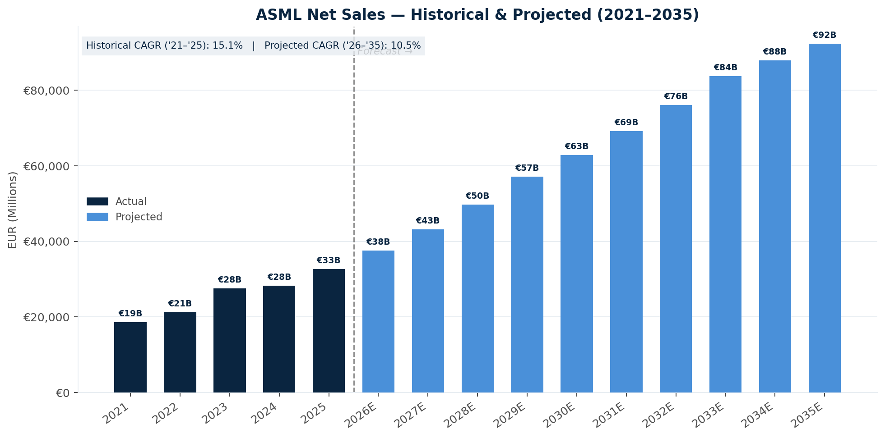
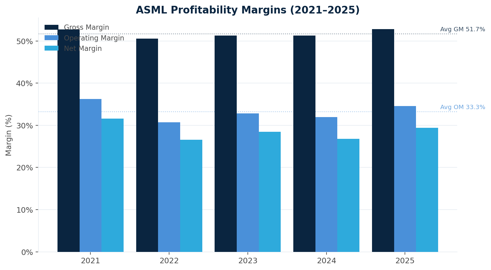
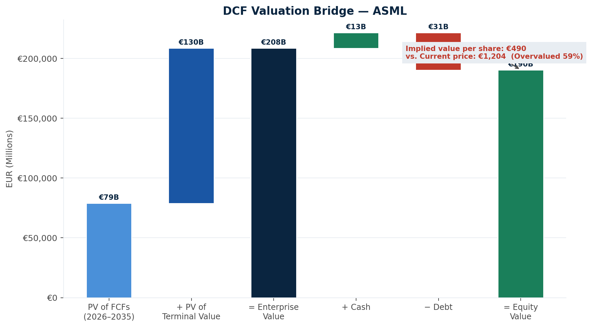
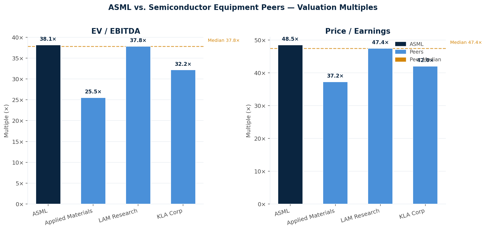
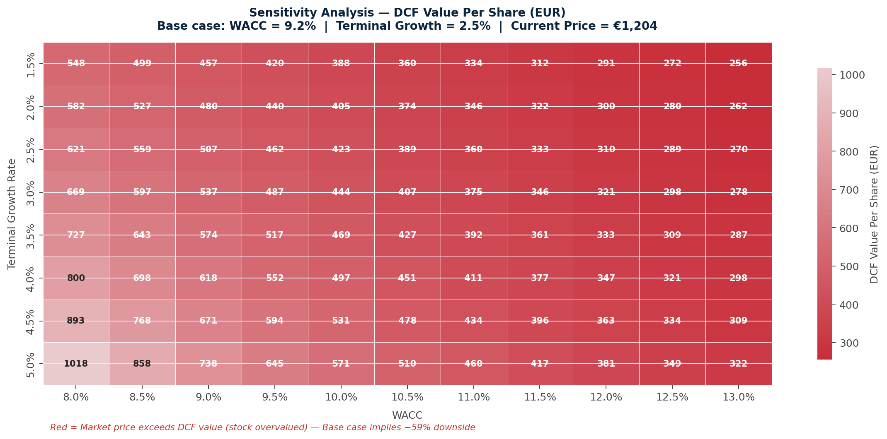

# ASML Holding NV — DCF Valuation Analysis

**Recommendation: SELL** &nbsp;|&nbsp; DCF Value: **€490** &nbsp;|&nbsp; Current Price: **€1,204** &nbsp;|&nbsp; Implied Downside: **−59%**

DCF valuation of ASML Holding NV (ASML:NA), the Dutch semiconductor equipment manufacturer that holds a global monopoly on Extreme Ultraviolet (EUV) lithography systems. This project builds a 10-year free cash flow model, a WACC calculation, a comparable company analysis against three semiconductor equipment peers, and a sensitivity analysis across 88 WACC/terminal growth scenarios.

---

## Key Findings

| Metric | Value |
|---|---|
| DCF Value Per Share | €490 |
| Current Market Price | €1,204 |
| Implied Downside | −59% |
| Enterprise Value (DCF) | €208B |
| WACC | 9.2% |
| Terminal Growth Rate | 2.5% |
| Revenue CAGR ('26–'35E) | 10.5% |
| 2025 Revenue | €32.7B |
| EV/EBITDA (current) | 38.1× vs. peer median 37.8× |

Despite ASML's exceptional business quality and structural monopoly in EUV, >50% gross margins, and a backlog driven by AI-related chip demand, the DCF analysis suggests the market is already pricing in a highly optimistic growth scenario. At €1,204, the stock embeds assumptions that leave little room for execution risk, cyclical softness, or geopolitical disruption (particularly US export restrictions on China).

---

## Repository Structure

```
ASML-Valuation-Analysis/
├── models/
│   └── ASML_DCF_Model.xlsx        -> ASML Excel model
├── notebooks/
│   └── generate_charts.py         -> Produces charts
├── outputs/
│   ├── charts/
│   │   ├── 01_revenue_growth.png
│   │   ├── 02_margin_analysis.png
│   │   ├── 03_dcf_waterfall.png
│   │   ├── 04_peer_comparison.png
│   │   └── 05_sensitivity_heatmap.png
│   └── investment_memo.md
└── README.md
```

---

## The Excel Model

The workbook contains eight interconnected tabs:

| Tab | Contents |
|---|---|
| Executive Summary | Dashboard — key assumptions, valuation output, recommendation |
| Historical Financials | Income statement, balance sheet, cash flow (2021–2025) |
| Projections | 10-year P&L and FCF forecast (2026–2035E) |
| DCF Calculation | Discount factors, PV of FCFs, terminal value, equity bridge |
| WACC | CAPM cost of equity, cost of debt, capital structure weights |
| Comparables | ASML vs. AMAT, LRCX, KLAC — EV/EBITDA, P/E, margins |
| Sensitivity | 8×11 two-way table: WACC (8–13%) × Terminal Growth (1.5–5%) |
| Data & Sources | Assumption log, data sources, model metadata |

---

## Charts

### Revenue — Historical & Projected (2021–2035)


Revenue grew at a 15.1% CAGR between 2021 and 2025, reaching €32.7B. The projection assumes a gradual deceleration: 15% growth through 2029 as EUV adoption continues, stepping down to 10% in 2030–2032 and 5% in the terminal years as the cycle matures.

---

### Profitability Margins (2021–2025)


Gross margins have been remarkably stable in the 51–53% range, reflecting ASML's pricing power and the absence of competitive alternatives in EUV. Operating margins averaged 33.3% over the period, with modest compression in 2022 driven by supply chain costs.

---

### DCF Valuation Bridge


The PV of projected FCFs (2026–2035) contributes €79B, with terminal value adding €130B. This suggests that 62% of the enterprise value sits in the perpetuity assumption. This high terminal value dependency is typical of capital-light, high-margin businesses but also represents the primary source of model risk.

---

### ASML vs. Semiconductor Equipment Peers


At 38.1× EV/EBITDA and 48.5× P/E, ASML trades broadly in line with the peer median (37.8× and 47.4× respectively). This is notable — ASML's structural monopoly and superior margins would typically warrant a premium. The lack of a meaningful premium suggests the market has already priced in the business quality, leaving little valuation support from a comps perspective.

---

### Sensitivity Analysis


Across all 88 scenarios tested, the implied value ranges from €256 (13% WACC, 1.5% terminal growth) to €1,018 (8% WACC, 5% terminal growth). The current market price of €1,204 is above every single scenario modelled, which is a striking result. Even in the most aggressive scenario (ultra-low discount rate, near-equity-like terminal growth), the stock does not reach its current trading price on a pure DCF basis.

---

## Methodology

### Revenue Projections
Based on ASML's published backlog and management guidance, I modelled three growth phases: 15% annually through 2029 (EUV capacity ramp, driven by TSMC, Samsung, and Intel advanced node buildouts), stepping down to 10% in 2030–2032 (market maturation and cyclical normalisation), and 5% in 2033–2035 (approaching terminal growth). The base year is 2025 actual revenue of €32,667M.

### Free Cash Flow
FCF is calculated as NOPAT + D&A − CapEx − Change in NWC. Gross margin is held at 57% (5-year historical average), EBIT margin at 37.5%, CapEx at 9% of revenue, and NWC at 15% of revenue. The tax rate assumption is 25%, consistent with the Netherlands statutory rate.

### WACC
Cost of equity is derived via CAPM using a risk-free rate of 4.25% (10-year US Treasury as of February 2026), a beta of 1.35 (calculated from 24-month rolling returns versus the S&P 500), and a market risk premium of 6.5% (Damodaran historical estimate). With ASML's near-zero leverage (debt/total capital < 1%), the WACC of 9.2% is almost entirely driven by the cost of equity.

### Terminal Value
Calculated using the Gordon Growth Model: Terminal FCF × (1 + g) / (WACC − g), where g = 2.5%. This is consistent with long-run nominal GDP growth for developed economies. The terminal value is discounted back 10 years to year-zero present value.

### Comparable Companies
| Company | EV/EBITDA | P/E | Gross Margin |
|---|---|---|---|
| ASML | 38.1× | 48.5× | 52.8% |
| Applied Materials | 25.5× | 37.2× | 48.7% |
| LAM Research | 37.8× | 47.4× | 49.8% |
| KLA Corporation | 32.2× | 42.0× | 61.6% |
| **Peer Median** | **37.8×** | **47.4×** | **49.8%** |

---

## Key Risks to the Bear Case

The model produces a SELL signal, but several factors could justify a higher valuation:

1. **AI-driven capex supercycle.** If hyperscalers and chip manufacturers sustain elevated investment longer than modelled, ASML's backlog (~€36B) could underpin revenue growth well above the 15% assumption.
2. **High-NA EUV pricing.** Next-generation High-NA EUV systems are priced above €350M per unit, materially above the current EUV generation. A faster adoption curve could expand margins and revenue simultaneously.
3. **Lower discount rate environment.** A 100bps compression in the risk-free rate would push the base case valuation to approximately €600, narrowing but not closing the gap to market price.

---

## Limitations

This model relies on publicly available financial data and analyst-derived assumptions. It does not incorporate ASML's full backlog detail, order-by-customer disclosures, or R&D pipeline specifics that would be available in a full sell-side research context. The comparables universe is limited to three peers; a broader range would provide a more robust triangulation.

---

## How to Run the Charts

```bash
# Install dependencies
pip install openpyxl matplotlib seaborn numpy

# Generate all charts from the Excel model
cd notebooks
python generate_charts.py
```


---

## Data Sources

- **ASML Holding NV** — Annual Reports 2021–2025, Investor Relations
- **10-Year US Treasury** — Federal Reserve (as of February 2026): 4.25%
- **Beta** — Calculated from 24-month monthly returns vs. S&P 500
- **Market Risk Premium** — Damodaran (NYU Stern), January 2026 update: 6.5%
- **Peer Multiples** — Yahoo Finance, February 2026

---

*Author: Stanley Vanderzypen; Part of ongoing equity research and financial modelling work aimed at internship recruiters.*
